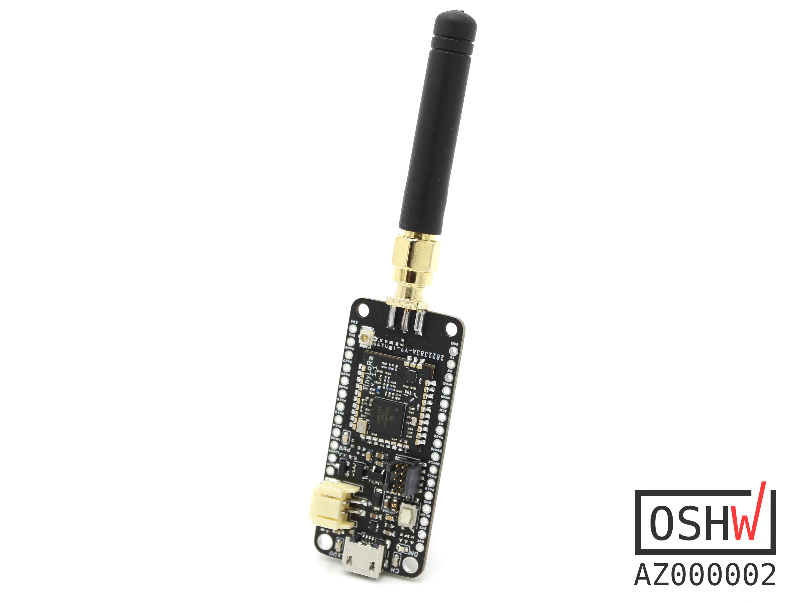

# Penguino Feather LoRa development board
This repo contains all the necessary design and fabrication files for the Penguino radio module and its @Adafruit Father style breakout board. First prototype batch is being sold on my [Tindie](https://www.tindie.com/products/16985/) store.

### Penguino Feather v1.1:

## Penguino RF Module v1.2 Specs:
- [ATSAMR34J18](http://ww1.microchip.com/downloads/en/DeviceDoc/SAMR34-R35-Low-Power-LoRa-Sub-GHz-SiP-Data-Sheet-DS70005356B.pdf) LoRA System-in-Package (SiP) based RF module
- ARM Cortex M0+ MCU & LoRa Radio
- 256KB Flash, 40 KB RAM
- Power Output: 20.00(dBm) (DS value, real output is not tested)
- Frequency Range: 862 to 1020 MHz (DS values)
- Sleep Current: ~810 nA 
- IO pins: 27
- Module Dimenions: ~16.5x14x2 mm

### Penguino RF Module v1.1:

### Penguino Feather 4260 v1.1:

### Penguino Feather v1.1 Blinky:

License:
- Hardware license: CERN-OHL-S v2
- Software license: under MIT unless otherise indicated 
- Documentation license:  CC BY-SA 4.0 International.

________________________________
## Open Source Hardware
This board is an OSHWA approved design: [AZ000002](https://certification.oshwa.org/az000002.html)
