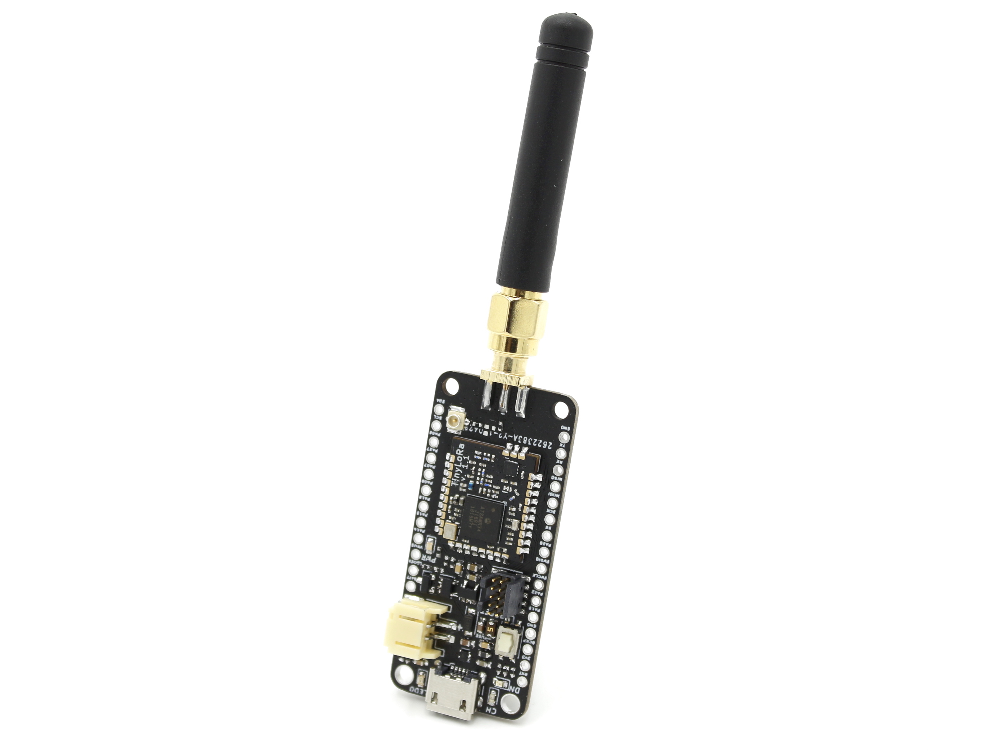
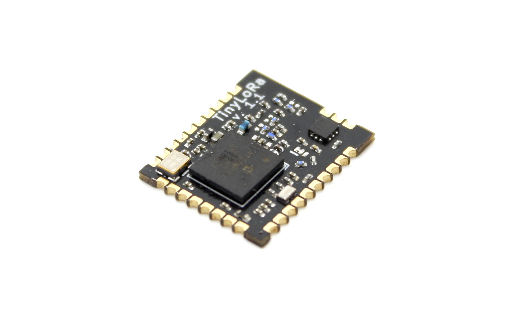
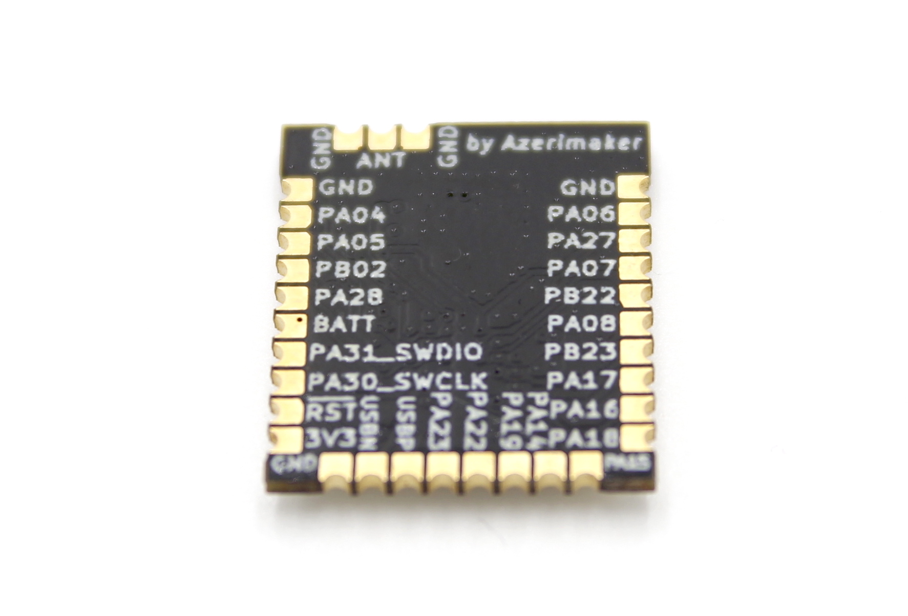
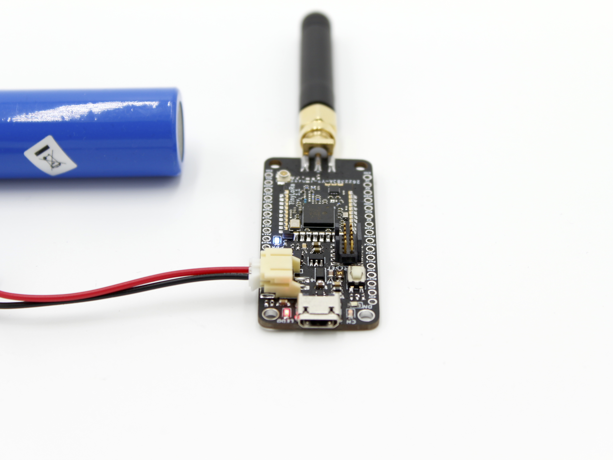

# TinyLoRa Module & Breakout
This repo contains all the necessary design and fabrication files for the TinyLora module and its Adafruit Father style breakout board. First prototype batch has been sold on [Tindie](https://www.tindie.com/products/16985/) and some more info can be found there.

### TinyLoRa Feather Breakout v1.1:

## Specs:
- [ATSAMR34J18](http://ww1.microchip.com/downloads/en/DeviceDoc/SAMR34-R35-Low-Power-LoRa-Sub-GHz-SiP-Data-Sheet-DS70005356B.pdf) LoRA System-in-Package (SiP) based RF module
- ARM Cortex M0+ MCU & LoRa Radio
- 256KB Flash, 40 KB RAM
- Power Output: 20.00(dBm) (DS value, real output is not tested)
- Frequency Range: 862 to 1020 MHz (DS values)
- Sleep Current: 790 nA (DS value for the SiP, module will be thoroughly tested soon)
- IO pins: 27
- Module Dimenions: ~16.5x14x2 mm

### TinyLoRa RF Module v1.1:

### TinyLoRa Feather Breakout v1.1 Blinky:

 This work is licensed under a <a rel="license" href="http://creativecommons.org/licenses/by-nc-sa/4.0/">Creative Commons Attribution-NonCommercial-ShareAlike 4.0 International License</a>.

