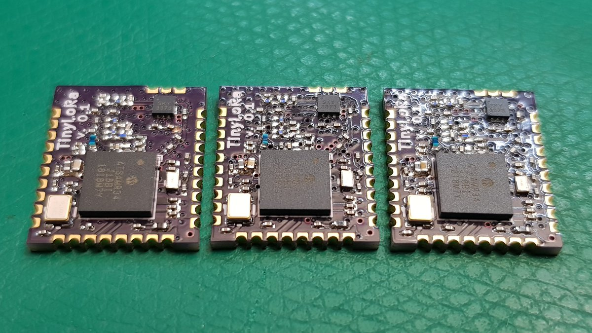

# TinyLoRa
This repo contains all the necessary design and fabrication files for the TinyLora module and its breakout board (in Feather form-factor).

## Specs:
- ATSAMR34 based LoRA module

  This work is licensed under a <a rel="license" href="http://creativecommons.org/licenses/by-sa/4.0/">Creative Commons Attribution-ShareAlike 4.0 International License</a>.

